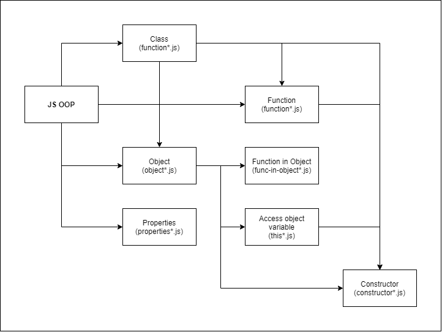

# Uderstanding JavaScript Function and Object

Here's the mind map about my understanding how OOP works in JavaScript:

# Function

Just how to declare the functions and calls it.

1. `function/function1.js`
2. `function/function2.js`
3. `function/function3.js`

# Object

In the JavaScript, the object and properties works as data structure or struct (in C/C++).

1. `object/object.js`: initiate object and create function in the class.
2. `object/function-in-object1.js`: initaiate object and create function in the class.
3. `object/function-in-object2.js`: different way to access class and function.
4. `object/function-in-object3.js`: create function in the class with params.
5. `object/function-in-object4.js`: create function in the class with return value.
6. `object/properties1.js`: about creating properties variable and access it.
7. `object/properties2.js`: different way to access properties variable.
8. `object/properties3.js`: change properties variable values.
9. `object/properties-vs-object1.js`: the comparasion between the object and the properties to represent the variable.
10. `object/properties-vs-object2.js`: the comparasion between the object and the properties to represent the function.
11. `object/constructor1.js`: how to initiate constructor.
12. `object/constructor2.js`: how to use and call constructor.
13. `object/constructor3.js`: how to use and call function inside the constructor.
14. `object/constructor4.js`: how functions param's access the constructor.
15. `object/this1.js`: access all object content.
16. `object/this2.js`: use this to return the function result.
17. `object/this3.js`: use this in constructor.

# Class

## Strict Mode

The bodies of **class declarations** and **class expressions** are executed in **strict mode** i.e. *constructor*, *static* and *prototype methods*, *getter* and *setter functions* are executed in strict mode.

## Constructor

The **constructor method** is a special method for creating and initializing an object created within a class. There can only be one special method with the name of **constructor** inside a class. A *SyntaxError* will be thrown *if the class contains more than one occurrence of a constructor method*.

A constructor can use the **super** keyword to **call the constructor of the super class**.

### Class Expression

A **class expression** is another way to **define a class**. Class expressions can be named or unnamed. The name given to a named class expression is local to the class's body. it can be retrieved through the class's (not an instance's) name property though. See `class/class-expression.js`.

### Prototype Methods

Initiate a class then create constructor, create two functions, ones is for the process named `calcArea()` and the other is getter named bby `area()` to get the value of the class with prototype methods. See `class/prototype-method.js`.

Basically is the prototype methods were same with object and properties, like struct and class in C/C++. To know how the difference between prototype methods with the object and properties. See `class/class-prototype-vs-object-vs-properties.js`.

### Static Methods

The `static` keyword defines a static method inside a class. Static methods are **called without instantiates their class** and **cannot be called through a class instance**. Static methods are often **used to create utility functions** for an application. See `class/static-method.js`.

### Prototype and Static Method

When a **static** or **prototype method** was called without a value for `this`, the `this` value will be undefined inside the method. **This behavior will be the same even if the `use strict` directive isn't present**, because code within the `class` syntax is always executed in strict mode. See `class/static-strict.js`.

If the above is written using **traditional function–based syntax**, then **autoboxing in method calls will happen in non–strict mode** based on the initial this value. **If the inital value is undefined, this will be set to the global object**. Autoboxing will not happen in strict mode, the `this` value remains as passed. See `class/static-non-strict.js`.

### Sub classing with `extends`

The `extends` keyword is used in class declarations or class expressions to **create a class as a child of another class**. See `extend-class/extends-class.js`.

If there is a constructor present in subclass, it needs to first call `super()` before using `this`. One may also extend traditional function-based `classes`. See `extend-class/extends-function-based.js`.

Note that classes cannot extend regular (non-constructible) objects. If you want to inherit from a regular object, you can instead use `Object.setPrototypeOf()`. See `extend-class/extends-inherit.js`.
